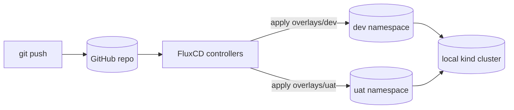

# Kubernetes_FluxCD

A GitOps-managed Django to-do app, deployed to a local Kubernetes cluster with
[FluxCD](https://fluxcd.io/), across `dev` and `uat` environments. The point of
this project isn't the to-do app — it's that Git is the only place the cluster's
desired state lives, and the cluster keeps re-converging to it on its own. If
you scale a deployment by hand, edit a live ConfigMap, or delete a resource
directly against the cluster, Flux notices on its next reconcile and reverts
it, because none of that happened in Git. That's the difference between "I
installed FluxCD" and "I understand GitOps": faster recovery from manual
mistakes, every change auditable as a commit, and rollback that's just
`git revert` instead of remembering what you touched.

## Architecture



Full breakdown of the reconciliation loop, the repo layout, and the FluxCD vs.
ArgoCD decision: [docs/architecture.md](docs/architecture.md).

## What this proves

- **Self-healing** — the live cluster is corrected back to match Git, not the
  other way around. See the demo below.
- **Declarative config** — `apps/todolist/base` plus per-environment Kustomize
  overlays (`overlays/dev`, `overlays/uat`) describe the desired state; nothing
  is applied ad hoc with `kubectl apply` after initial bootstrap.
- **Auditable changes** — every change to what's running is a commit to this
  repo, with a diff and an author, not a shell history.
- **Rollback via `git revert`** — reverting a bad manifest change is reverting
  a commit; Flux picks it up on the next poll like any other change.

## Drift correction, live

> _TODO (before publishing): record the demo in
> [docs/drift-demo.md](docs/drift-demo.md) and drop the recording here._
>
> `docs/screenshots/drift-demo.gif`

The short version: `kubectl scale deployment app -n dev --replicas=5` against
the live cluster, then Flux's next reconcile scales it back to the `1` replica
declared in `apps/todolist/overlays/dev` — with no `kubectl apply` from a
human. Full script and what to capture: [docs/drift-demo.md](docs/drift-demo.md).

## Why FluxCD over ArgoCD

Short version: Flux's GitOps config is itself a set of Kubernetes CRDs living
in this repo, which keeps everything — controllers included — reviewable the
same way as the app manifests, and its `Kustomization` resource maps directly
onto plain `kustomize build`, so overlays can be rendered and checked locally
before anything is pushed. Full reasoning in
[docs/architecture.md](docs/architecture.md#why-fluxcd-over-argocd).

## Repo layout

```
apps/todolist/        # the app: Django + nginx + Postgres, base + dev/uat overlays
clusters/kind/         # Flux's own controllers + the two Kustomizations that sync the app
docs/                  # architecture, setup, and the drift-demo script
```

## Running this yourself

Full instructions, including bootstrapping Flux against your own fork and
encrypting secrets with SOPS: [docs/setup.md](docs/setup.md).
