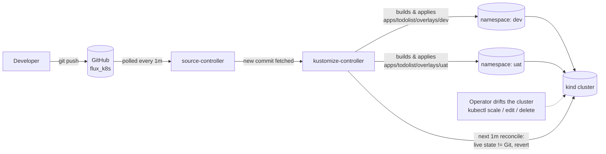

# Architecture

## Repository layout

```
apps/
  todolist/
    base/               # the app: Django + nginx sidecar + Postgres, env-agnostic
    overlays/
      dev/              # dev namespace, 1 replica, no resource limits
      uat/              # uat namespace, 2 replicas, resource requests/limits
clusters/
  kind/
    flux-system/        # Flux's own controllers (source-controller, kustomize-controller, ...)
    apps-dev.yaml        # Flux Kustomization -> apps/todolist/overlays/dev
    apps-uat.yaml        # Flux Kustomization -> apps/todolist/overlays/uat
```

One app, one Git history, two environments. `dev` and `uat` build from the same
`base/` with Kustomize patches for the differences that actually change between
environments (replica count, resource limits) — not a forked copy of the manifests.

## Reconciliation loop



- **source-controller** polls the GitHub repo (`clusters/kind/flux-system/gotk-sync.yaml`
  defines the `GitRepository`) every minute and stores the latest commit as an artifact.
- **kustomize-controller** watches that artifact and, for each `Kustomization` object
  (`apps-dev.yaml`, `apps-uat.yaml`), runs `kustomize build` on the referenced path and
  applies the result with server-side apply.
- Because `prune: true` is set, resources removed from Git are removed from the cluster
  too — Git is the full source of truth, not just an initial seed.
- Every reconcile diffs the live cluster against the rendered manifests. If someone
  runs `kubectl scale`, edits a ConfigMap by hand, or deletes a resource directly, the
  next reconcile (at most 1 minute later, or immediately with
  `flux reconcile kustomization <name> --with-source`) overwrites the drift and puts
  the cluster back to what's declared in Git.

## Why this proves GitOps, not just "Flux is installed"

Anyone can run `flux bootstrap` once and call it done. The thing that's actually being
tested here is: **if the cluster and Git disagree, which one wins — every time, automatically,
without a human re-applying anything?** That's what [docs/drift-demo.md](drift-demo.md)
walks through and captures evidence for.

## Why FluxCD over ArgoCD

Both are solid, CNCF-graduated GitOps controllers and either would work for this project.
I picked Flux for three reasons specific to how this repo is structured: it's a set of
Kubernetes CRDs (`GitRepository`, `Kustomization`, `HelmRelease`) reconciled by
controllers rather than a separate UI-first application, which keeps the entire GitOps
config itself declarative and diffable in this same repo instead of living in ArgoCD's
own App-of-Apps objects or its web UI. Flux's `Kustomization` resource maps directly
onto plain `kustomize build` output, so `apps/todolist/overlays/dev` and `overlays/uat`
can be rendered and sanity-checked with `kubectl kustomize` locally, with no controller
running, before anything is pushed. And bootstrapping is a single CLI command
(`flux bootstrap github ...`) that commits Flux's own manifests into this repo, so the
tool that manages the cluster is itself managed the same way as the workloads it
deploys — there's no separate install story to document. ArgoCD's UI and multi-cluster
app-of-apps model is arguably nicer for managing many teams/clusters at once, but for a
single-cluster, single-app demo it would be more surface area than the story needs.
